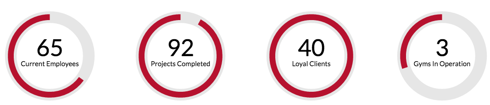

# ArcCounter

A native canvas javascript plugin for counting to a number with an
animated arc around the number.

An example is provided in index.html so you can see the animation, but
here is a screenshot so you can see a quick example.



## Installation

Add the script and css file to your page. The css is not necessary, but
it will leave placeholders for your counters while the page is loading.
Otherwise the counters will be have 0 height and then get a height after
the counter load, causing the page to jerk a little bit.

    <script src="js/arc-counter.js"></script>
    <link rel="stylesheet" href="css/arc-counter.css">

It's best to add the script to the footer since there is no document
ready function in it.

Then the most basic way to get started is to add the ArcCounter call
after you've included the js file.

    <script>
        new ArcCounter();
    </script>

Now we will add the html for the counters.

    <div class="arc-counter" data-number="65" data-max="100" data-text="Current Employees"></div>

Most of the data for the counters come from these data attributes.

- ```data-number```: is the number that is being counted to.
- ```data-max```: is the maximum number represented by the counter. This
is used to determine how far the arc around the counter should go.
- ```data-text```: is the text that will be displayed below the counter.
- ```data-background```: is the entire background color of the canvas,
but by default the canvas is transparent so you can just color the
containing element however you'd like and the canvas will show that.

But, there are also some attributes you can add to the ArcCounter
initialization that will be applied to all the counter.

The defaults are presented below.

        var defaults = {
            selector: '.arc-counter',
            strokeColor: '#fff',
            fillColor: 'rgba(0, 0, 0, 0.1)',
            textColor: '#000',
            fontFace: 'Calibri',
            duration: 3000,
            easingFunction: 'easeInOutQuint',
            responsive: true
        };

- ```selector```: is the css selector for your counters. If you change
this you can change the css to reflect your counter class. Or omit the
css either will work.
- ```strokeColor```: is the color of the arc
- ```fillColor```: is the color of the circle behind the arc
- ```textColor```: is the color of the text inside the circle
- ```fontFace```: is the font you wish to use for the counter and text
- ```duration```: is how long it takes for the counter to finish
counting
- ```easingFunction```: is the function you want to use when drawing the
arc
- ```responsive```: if true will attache a resize event to the window so
the arcs are always 100% of their container.

You can set one or many options as follows:

    <script>
        new ArCounter({
            strokeColor: '#a90d2c',
            fontFace: 'Lato'
        });
    </script>
    
The previous options will create a counter that has a red stroke and
uses Lato for the text.
